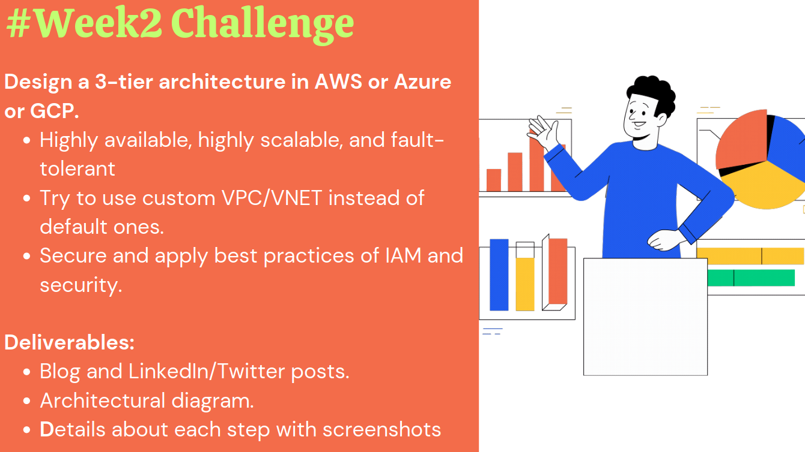

**AWS Three Tier Web Architecture**

Above you can find the deliveriables

Followed below docs for making up this project

https://catalog.us-east-1.prod.workshops.aws/workshops/85cd2bb2-7f79-4e96-bdee-8078e469752a/en-US

https://devopswithgopal.hashnode.dev/architecting-3-tier-application-on-aws-vpc-with-asg-elb-along-backup-plan

Achived through usage/learnings below

VPC - Subnets - Routing - Security Groups - NAT Gateway - Internet Gateway

RDS Deployment - used Aurora Mysql - Configuring with instances Apptier

Load Balancers - Target Groups - using the security groups connecting load balancers to the instances

AMI Creating - adding AMI to Launch template - creating AMI's for both Apptier and webtier

Auto Scaling Groups - using EC2 launch templates 

Adding details to the Config files for RDS database connection  - Nginx configs for the web server

